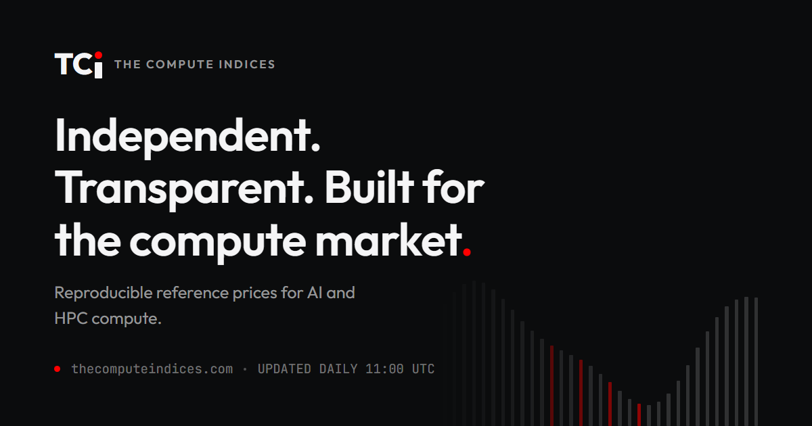

[](https://thecomputeindices.com)

# TCI — The Compute Indices

[](https://github.com/markrusch/Compute-Indices/actions/workflows/test.yml)
[](https://github.com/markrusch/Compute-Indices/actions/workflows/daily.yml)
[](LICENSE)
[](LICENSE-docs)
[](DATA-TERMS.md)
[](pyproject.toml)
[](https://thecomputeindices.com)

**TCI** — a daily, fully reproducible reference price for renting AI compute in the
EU/EEA. Headline series **TCI-CRI-H100**: one NVIDIA H100 SXM 80GB GPU-hour, on-demand,
per-GPU, ex-VAT, from an EU/EEA data centre, in USD with a EUR companion at the ECB
reference rate (T-1). Companion series by market segment (`-MKT` marketplace, `-NC`
neocloud, `-HS` hyperscaler catalog, `-SOV` EU-incorporated operators), by generation
(H200, B200, B300, A100, H100-PCIe), and **TCI-CRI-COMPUTE**, a chain-linked composite
that follows the observed market across hardware generations.

The credibility strategy is reproducibility, not scale: every parameter is a visible
config value, the methodology document is generated from that config, raw observations
are immutable, every print carries a queryable constituent set, and the whole thing can
be rebuilt from public sources by anyone with the repo. Design follows the IOSCO
Principles for Financial Benchmarks (2013) as voluntary best practice — see
[GOVERNANCE.md](GOVERNANCE.md), [METHODOLOGY.md](METHODOLOGY.md), and
[SOURCES.md](SOURCES.md).

> **TCI is a price-transparency benchmark, not a settlement benchmark.** It is a
> research publication, is not investment advice, and may not be used as a reference
> price in financial instruments. It has **no transaction feed** and does not claim one.
> The conditions that would have to be met before settlement use is credible are
> published in [GOVERNANCE.md](GOVERNANCE.md); as of v0.3.0, six of the seven are unmet.

Why it was rebuilt in v0.3.0, and what was wrong before:
[research/composition-vs-price.md](research/composition-vs-price.md).

## Contents

- [Quickstart](#quickstart)
- [Commands](#commands)
- [Layout](#layout)
- [Deploying the dashboard](#deploying-the-dashboard)
- [Changing the methodology](#changing-the-methodology)
- [Licence](#licence)

## Quickstart

```bash
python -m venv .venv
.venv/Scripts/activate            # Windows; source .venv/bin/activate on Linux
pip install -e .[dev]
python -m tci.run migrate       # create data/eucri.db
python -m tci.run daily         # collect today's observations + compute all series
python -m tci.run constituents --date 2026-07-18
pytest
```

## Commands

| Command | Purpose |
|---|---|
| `migrate` | apply database migrations |
| `daily [--date D]` | run collectors (idempotent per source+day), compute all series, regenerate the site, CSV and charts |
| `constituents --date D [--series S]` | full audit table for a print (IOSCO P13/P16) |
| `backfill --from D --to D` | recompute prints from stored observations (never re-collects) |
| `reproduce [--date D] [--published]` | recompute every stored print under the version live on its date and compare it field by field with what was published; `--published` also checks every digest in `site/data/prints/*.json`, `site/data/v1/series/*.json` and `latest.json`, and reports a stored print the site never published. Exit 0 = everything matched |
| `canary [--source ID]` | collect from every live source into a throwaway database and report what stopped reporting; touches neither the record nor the site |
| `reliability [--series S] [--coverage S --days N]` | the gap log, and how many providers would have met a series' gate on each session |
| `effect --date D --before X --after Y` | recompute one date under two methodology versions and report the difference per series; writes nothing |
| `mlperf [--refresh]` | MLPerf Training results from sellers priced here, against those prices, from a snapshot pinned to an upstream commit |
| `term [--date D]` | term-price cells for one date against the 3-seller publication threshold, and which cells are one seller away |
| `weights [--date D]` | show the stored weight review for a date (v0.3.0 weights providers by tier; reviews are retained for audit, not used in the calculation path) |
| `validate` | source-dropout sensitivity + optional check-series correlation |
| `post` | regenerate the paste-ready Substack post |
| `docs` | regenerate METHODOLOGY.md + METHODOLOGY.lock |
| `sources` | the source register, the review clock, and per-region coverage of what has been collected (`--due`, `--status`, `--block`) |
| `contrib validate\|ingest\|aggregate` | contributed term prices: check a submitted CSV, store it in the private store outside the repository (`--contributor`, `--supersedes` for a one-row correction), or write the publishable aggregates (`--from`, `--to`, `--out`). See [CONTRIBUTING-PRICES.md](CONTRIBUTING-PRICES.md) |

## Layout

- `config/` — all methodology parameters (`factors.yaml`), sovereign constituent list,
  static provider price entries with `last_verified` dates
- `src/tci/` — collectors (fail-soft, 1 request/source/day, honest User-Agent),
  normalisation, index calculation, outputs
- `data/eucri.db` — SQLite, committed; observations and prints are append-only
  (trigger-enforced)
- `site/` — the published site, **regenerated from the database on every daily run** by
  `src/tci/outputs/site.py`; do not hand-edit the HTML. Pages: `index.html`
  (dashboard), `basis.html` (the EU-US basis), `term.html` (commitment discounts),
  `methodology.html`, `data.html`, `governance.html`, `notices.html`, `research.html`
  and `research/*.html`. Plus `assets/` (the design system: `tokens.css`, `site.css`),
  `reliability.html` (every session that did not print). Plus `assets/` (the design
  system: `tokens.css`, `site.css`), `data/` (CSV history, `latest.json`, one print
  file per date under `prints/`, and the versioned read interface under `v1/`: a
  catalogue plus one file per series carrying its whole history and a digest per
  session), and `charts/` (PNGs used by the Substack post, not by the site — the site
  draws its own inline SVG).
- `site/components.html` — the design-system component gallery. A reference artefact, not
  linked from the site.
- `DESIGN.md` — the design system spec: tokens, chart rules, density, contrast ratios.
- `research/*.md` — research notes, rendered to `site/research/` by the generator.
- `config/source_links.yaml` — reference weblinks for the Sources panel and per-constituent
  links. Presentational only; not part of METHODOLOGY.lock.
- `config/source_registry.yaml` + `config/regions.yaml` — the source register (including
  everything screened and rejected, with reasons) and the region blocks. One block is
  published; eight are **shadow**: collected and stored, published nowhere, building the
  history a future regional index will need. Neither file is read by the calculation path.
  Maintained by the monthly process in `.claude/skills/source-discovery/`, whose sweeps are
  written up in `research/source-scans/`.

## Deploying the dashboard

`site/` is a self-contained static site plus one optional serverless endpoint, so it can
be hosted anywhere that serves static files. Two targets are wired up:

- **Vercel — the canonical home, [thecomputeindices.com](https://thecomputeindices.com).**
  Import the repo with **Root Directory set to `site`**.
- **GitHub Pages — the mirror.** `.github/workflows/pages.yml` deploys `site/` on every
  push that touches it. Served at `https://markrusch.github.io/Compute-Indices/`.

Both targets serve **byte-identical** content. Every link in the generated site is
relative, so the site works equally at a subpath and at a domain root. The one absolute
self-reference is the canonical URL and the social-card metadata, which name the domain
on both hosts — that is the point of a canonical, and it stops the mirror competing with
the canonical site for the same content in search results.

The only `<script src>` on the page is Vercel Web Analytics, at a same-origin path. It is
inert on Pages, where the file does not exist. Vercel already serves the canonical site
and so already sees every request to it, so this hands nothing to a party that was not
already in the path; no visitor's IP reaches a third party, which is the claim the site
actually makes.

`site/api/refresh.js` is a Vercel-only serverless endpoint that can trigger `daily.yml`
on demand. **The v0.3.0 dashboard does not surface it** — deliberately, so the two hosts
behave identically rather than one carrying a button the other cannot honour. The
endpoint still functions if called directly; to use it, set two Vercel **Environment
Variables** (Project Settings → Environment Variables — never committed to the repo):
  - `GITHUB_DISPATCH_TOKEN` — a token scoped to just this repo's Actions
    (read/write), e.g. a fine-grained PAT limited to `markrusch/Compute-Indices`
  - `GITHUB_REPO` — `markrusch/Compute-Indices`

  The refresh endpoint refuses any date other than today (in UTC): these collectors
  report live market prices, not history, so a past date can never be honestly
  re-collected — see `GOVERNANCE.md` and `STYLE.md` on why a gap stays a gap.

## Changing the methodology

Not casually. Every print is computed under the methodology version live on its date
(`config/methodology/succession.yaml`): the head of the succession is `config/factors.yaml`,
and every superseded version is frozen under `config/methodology/<version>/` with its own
rendered METHODOLOGY.md. Only providers, collectors and classes named in the version's
`panel` reach a print; a new collector stores rows from day one and moves nothing until a
version admits it. Any change to `config/factors.yaml`, `config/sovereign.yaml`,
`config/methodology/succession.yaml`, `src/tci/index.py`, `src/tci/normalise.py`, or
`src/tci/weights.py` fails CI unless the version is bumped, the CHANGELOG has an entry, and
the lock is regenerated, and it takes effect only from the effective date its notice
states. A change to a frozen version is refused outright, and a code change that alters
any stored print fails `tests/test_reproduce.py`. Scheduled weight reviews execute
a fixed published formula and are data updates, not methodology changes. Procedure:
[GOVERNANCE.md](GOVERNANCE.md).

## Licence

Three kinds of material live here, under three different terms. A licence over source
code does not carry rights in the data a program produces, so they are stated separately.

| Material | Terms |
|---|---|
| **Software** — `src/`, `tests/`, build config | [Apache&nbsp;2.0](LICENSE) |
| **Documentation and research** — `METHODOLOGY.md`, `GOVERNANCE.md`, `SOURCES.md`, `DESIGN.md`, `STYLE.md`, `research/*.md` | [CC&nbsp;BY&nbsp;4.0](LICENSE-docs) |
| **Index data** — `site/data/`, `data/eucri.db` | [DATA-TERMS.md](DATA-TERMS.md) |

The methodology is openly licensed on purpose: a benchmark that cannot be checked is not
a benchmark, and this repo already claims every print is recomputable from public sources.
That claim is only real if you are actually permitted to do it.

**Name.** "TCI" identifies this benchmark and the values published under it. Cite it,
critique it, build on it — but a fork must carry its own name, because a benchmark name
says who computed the value and under which published methodology. See [NOTICE](NOTICE).

**Status.** TCI is a research publication: not investment advice, not administered by
an authorised benchmark administrator under Regulation (EU) 2016/1011, and not for use as
a reference price in a financial instrument. See [GOVERNANCE.md](GOVERNANCE.md).
