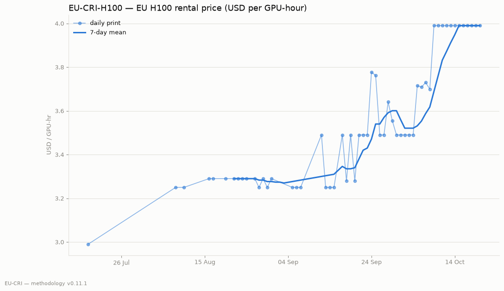
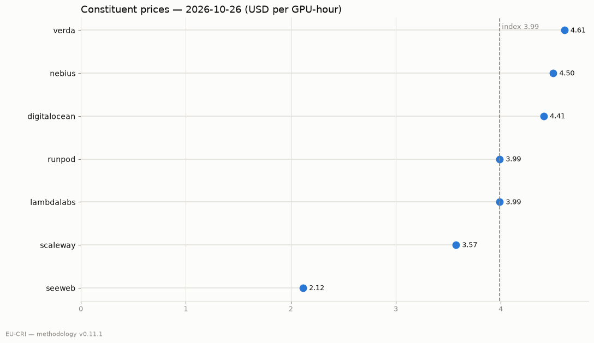

# EU-CRI weekly — 2026-10-19

**EU-CRI-H100: $3.99 / GPU-hour** (€3.55 at ECB 1.1253 on 2026-10-16)

Week-over-week: +0.0% · Month-over-month: +14.3% · Constituents: 7 (1 executable-quote)

7-day mean: $3.99

<!-- EDITORIAL: lead commentary -->

Dispersion: cheapest constituent $2.13, dearest $4.50 — a 2.1x spread for the same reference unit.

| provider | tier | $/GPU-hr | weight |
|---|---|---|---|
| seeweb | list | $2.13 | 12 |
| scaleway | list | $3.59 | 12 |
| lambdalabs | list | $3.99 | 12 |
| runpod | executable | $3.99 | 25 |
| verda | list | $4.34 | 12 |
| digitalocean | list | $4.41 | 12 |
| nebius | list | $4.50 | 12 |
| aws |  | $0.00 | 0 | *(excluded: out_of_population)*
| azure |  | $0.00 | 0 | *(excluded: out_of_population)*
| coreweave |  | $0.00 | 0 | *(excluded: not_in_panel)*
| gcp |  | $0.00 | 0 | *(excluded: out_of_population)*
| oci |  | $0.00 | 0 | *(excluded: out_of_population)*

<!-- EDITORIAL: energy overlay comment -->

---

*Methodology v0.11.1 — full methodology, constituent-level audit trail, and source code are public in the repository. Corrections are published as flagged revisions, never silently.*

*TCI is a research publication. It is not investment advice and is not administered as a benchmark under EU Regulation 2016/1011; it may not be used as a reference price in financial instruments.*
